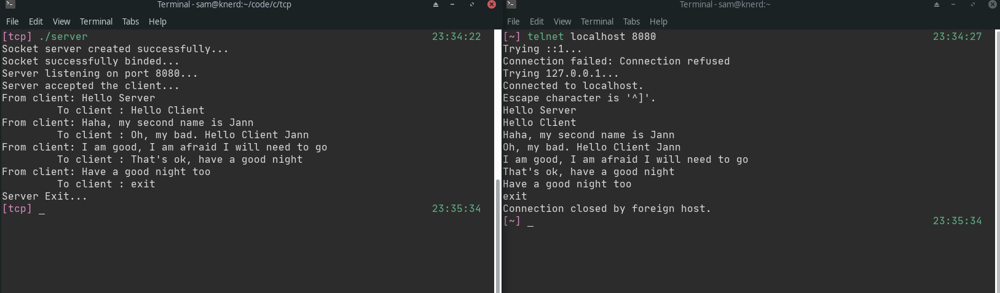

## TCP Server

This is a simple TCP server in C. Compile and run the program. It runs on port 8080.

To test, open another terminal and do

```
tcp localhost 8080
```

You can then type messages and press Enter. The message should appear on the server terminal. You can then type the response on the server terminal and the response will appear on the clients terminal.

You can do this back and forth until you send `exit` to the client.

Sample:



---

> [_rapando](https://twitter.com/_rapando)